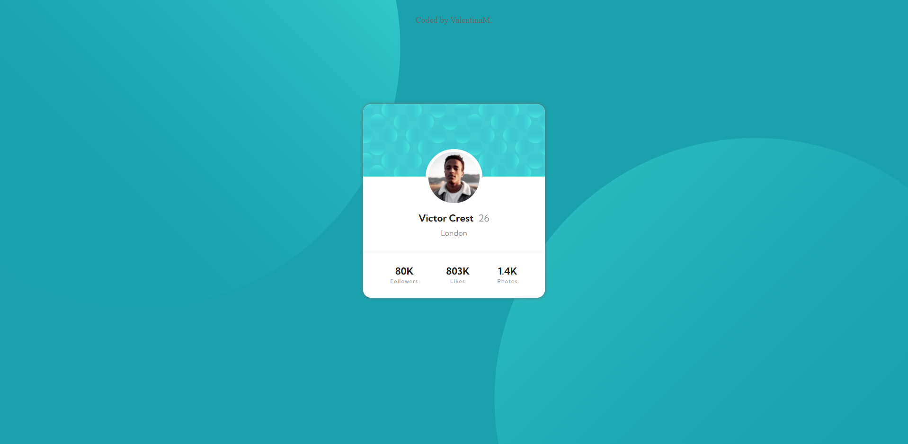

# Frontend Mentor - Profile card component solution

This is a solution to the [Profile card component challenge on Frontend Mentor](https://www.frontendmentor.io/challenges/profile-card-component-cfArpWshJ). Frontend Mentor challenges help you improve your coding skills by building realistic projects.

## Table of contents

- [Overview](#overview)
  - [The challenge](#the-challenge)
  - [Screenshot](#screenshot)
  - [Links](#links)
- [My process](#my-process)
  - [Built with](#built-with)
  - [Continued development](#continued-development)
- [Author](#author)
- [Acknowledgments](#acknowledgments)

## Overview

### The challenge

- Build out the project to the designs provided

### Screenshot

Mobile version:

### Links

- Production URL: [http://valentina-milicevic-prod-profile-card-component.vercel.app](http://valentina-milicevic-prod-profile-card-component.vercel.app)
- Development URL: [http://valentina-milicevic-dev-profile-card-component.vercel.app](http://valentina-milicevic-dev-profile-card-component.vercel.app)

## My process

### Built with

- Semantic HTML5 markup
- CSS custom properties
- Flexbox

### Continued development

- In future development I would like to wrap Profile card into React component
- In future development I would like to try using SCSS/BEM CSS notation
- In future development I would like to try out Next.js

## Author

- Website - [Valentina Milicevic](https://github.com/vanjamilicevic)
- Email - valentina.milicevic@quantoxtechnology.com